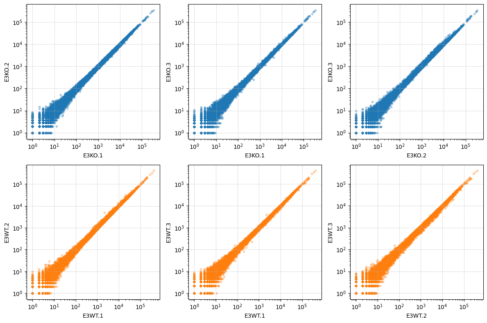
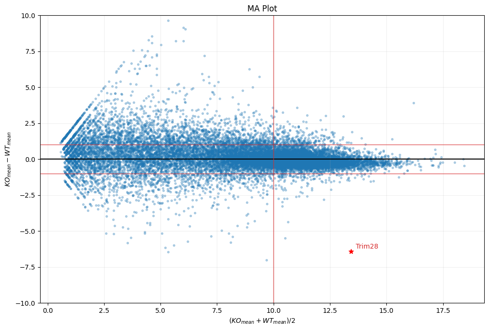

[](https://classroom.github.com/a/fFB6bVt0)
# Labo Pandas <!-- omit in toc -->


L'objectif de ce laboratoire est une introduction au *Data Science* et donc au traitement de données Pandas. Le contexte est l'analyse de données génétiques résultantes d'un séquençage d'ADN.

**Durée**: 2 périodes + travail à la maison

## Sommaire <!-- omit in toc -->

- [Concepts à découvrir](#concepts-à-découvrir)
- [Contexte](#contexte)
- [L'expérience biologique](#lexpérience-biologique)
- [Les données](#les-données)
- [Cahier des charges](#cahier-des-charges)
  - [Création de l'environnement de travail](#création-de-lenvironnement-de-travail)
  - [Première partie : acquisition et préparation des données](#première-partie--acquisition-et-préparation-des-données)
    - [Chargement des données](#chargement-des-données)
    - [Prise de connaissance des données](#prise-de-connaissance-des-données)
    - [Paramétrer l'affichage](#paramétrer-laffichage)
    - [Gènes avec un nom plus long que 13 caractères ?](#gènes-avec-un-nom-plus-long-que-13-caractères-)
    - [Gènes comportant le mot `glutamyl`](#gènes-comportant-le-mot-glutamyl)
    - [Nettoyage des données](#nettoyage-des-données)
    - [Nombre de gènes différents](#nombre-de-gènes-différents)
    - [Création d'un index](#création-dun-index)
    - [Hiérarchisation](#hiérarchisation)
  - [Deuxième partie : analyse de données](#deuxième-partie--analyse-de-données)
    - [Histogrammes](#histogrammes)
    - [Représentation logarithmique](#représentation-logarithmique)
    - [Scatter](#scatter)
    - [Calcul des moyennes par groupe](#calcul-des-moyennes-par-groupe)
    - [MA Plot](#ma-plot)
    - [Identification des extrêmes](#identification-des-extrêmes)
  - [Exportation du notebook](#exportation-du-notebook)
- [Conclusion](#conclusion)
- [Tests et intégration continue](#tests-et-intégration-continue)

## Concepts à découvrir

Les concepts à découvrir lors de ce labo sont les suivants :

- [Pandas](https://pandas.pydata.org/)
- Traitement de données tabulées
- Affichage de graphiques avec [Matplotlib](https://matplotlib.org/)
- [Jupyter](https://jupyter.org/) Notebook

## Contexte

Le [Gene Expression Core Facility](https://www.epfl.ch/research/facilities/gene-expression-core-facility/) de l'[EPFL](www.epfl.ch) est spécialisé dans les analyses fonctionnelles et quantitatives de génomes. Le laboratoire permet par exemple la mesure de l'efficacité d'un médicament sur l'expression d'un gène spécifique.

Lors d'une expérience en laboratoire, les cellules dans une boîte de Petri génèrent continuellement de l'ARN à partir de leur matériel génétique (ADN), comme elles le feraient _in vivo_. Cet ARN est ensuite converti grâce aux [ribosomes](https://fr.wikipedia.org/wiki/Ribosome) en [protéines](https://fr.wikipedia.org/wiki/Prot%C3%A9ine). On peut montrer que la production excessive de certaines protéines peut être la cause de certaines maladies graves. Il est donc capital de pouvoir analyser et comprendre l'expression des gènes.

Le biologiste cherche autant que possible à déterminer comment se comporte l'expression des gènes dans des cellules lorsqu'il perturbe l'expression d'un gène particulier par l'adjonction d'une ou plusieurs molécules bien choisies (médicament). En analysant cette réponse, il pourra tirer des conclusions sur la fonction du gène qu'il a perturbé.

Le [génome](https://fr.wikipedia.org/wiki/G%C3%A9nome) humain est composé d'environ 22'000 gènes, soit environ 3'400'000'000 paires de bases et partage 99% de similitude avec le [chimpanzé](https://fr.wikipedia.org/wiki/Chimpanz%C3%A9) ; même le génome de la banane (apprécié des gorilles), bien que très éloignée de l'homme, possède beaucoup de similitudes avec le génome humain.

Le biologiste qui souhaite comprendre le rôle de la protéine qu'il perturbe demande le séquençage de l'ARN de ses cellules en boîte de Petri. La procédure est complexe et passe par plusieurs étapes [cDNA](https://fr.wikipedia.org/wiki/ADN_compl%C3%A9mentaire) (conversion de l'ARN en ADN), [sonication](https://en.wikipedia.org/wiki/Sonication), [PCR](https://en.wikipedia.org/wiki/Polymerase_chain_reaction) et enfin séquençage. Le résultat est un fichier texte comportant les séquences ADN décodées : de longues suites de bases :

```text
cgctaactgcatcgcattccctctagaaagtggaataaaaaagacagcctgaaaacaact
tgcagatcttacaacaatcttctcaagttaatcggaccgtcgaaactgcatccctgcgag
catatatggaacttacggcgaatcagtccggaatgtctaccactaccagagttcgggggg
gaacgattacagtagcacgctattgatatacaactacctttacttgtccgccaagtgacc
cagttgtacactacgtacgcactttgcgcccacgatatggaattgactcggtgttttttt
agtggcggttggccaattggccatctagaaaaggggcgtgtcattagtgccgattctgta
cgcacgcaatgccacggttcgcttcacacagggcgatgctgaattgcgatcatattacag
gtagcaacaggtagtccatgtcccgtccccctgtccaagtgtaggaggcatcccacgtta
ccaggttatccgcggttcggacccgaaaaccagctgaccacaaattttttctgaccccag
```

À partir de plusieurs bases de données du génome humain complet construites à partir de l'agrégat de milliers d'humains (majoritairement des Européens et des Américains), les séquences obtenues sont comparées pour identifier à quel gène elles appartiennent. Le résultant est le comptage du nombre de séquences qui appartiennent à tel ou tel gène. On notera que chaque gène est codifié comme par exemple le gène nommé [TRIM28](https://www.genecards.org/cgi-bin/carddisp.pl?gene=TRIM28).

Voici un exemple de données obtenues après comptage des occurrences :

| Nom du gène | Occurrences |
| ----------- | ----------- |
| ENPP4       | 231         |
| CCL18       | 32          |
| SS18L2      | 7           |
| GLT8D1      | 2031        |
| ...         | ...         |

Dû à de multiples facteurs, ces données doivent encore être normalisées selon des méthodes assez complexes. En fin de compte, le nombre d'occurrences (un nombre réel) représente l'expression de tel ou tel gène dans un échantillon.

En résumé :

- Le bio-informaticien reçoit des résultats de séquençage sous forme de fichiers texte.
- L'analyse complexe de ces fichiers permet d'obtenir le nombre d'occurrences de chaque gène.
- La banane nous est proche.

## L'expérience biologique

La biologiste effectue plusieurs expériences consistant à modifier l'ADN de certaines cellules grâce à la technologie [CRISPR-Cas9](https://fr.wikipedia.org/wiki/Clustered_Regularly_Interspaced_Short_Palindromic_Repeats), une sorte de ciseaux microscopique qui permet d'éditer l'ADN. Dans cette expérience, la biologiste retire de la cellule un gène nommé `Trim28` et souhaite étudier les conséquences de ce retrait sur l'expression des gènes. Ce retrait est appelé un *Knock out*, ou **KO** alors que les échantillons de cellules non traitées sont appelés *Wild type* ou **WT**.

L'opératrice effectue 2 expériences qu'elle réplique chaque fois 3 fois pour minimiser les incertitudes de traitement. Ceci conduit à 6 sets de résultats :

- **KO** du gène cible, réplicat 1
- **KO** du gène cible, réplicat 2
- **KO** du gène cible, réplicat 3
- **WT** cellules, réplicat 1
- **WT** cellules, réplicat 2
- **WT** cellules, réplicat 3

On aura donc l'expérience **KO** qui devrait contenir moins de *Trim28* et l'expérience **WT** qui servira de contrôle.

Après l'analyse complète des données séquencées par les bio-informaticiens, les résultats qui nous concernent se retrouvent dans un fichier texte, typiquement du CSV avec **délimiteur tabulaire** comportant les données pour chaque expérience :

```text
symbol	E3KO_1	E3KO_2	E3KO_3	E3WT_1	E3WT_2	E3WT_3
Ptprk	2072.675	1996.648	1854.140	5357.473	5147.197	5415.744
Krt17	57.774	57.754	43.869	600.903	544.950	637.146
Adc	941.937	906.650	880.067	128.126	136.237	169.827
Nlrp4f	1584.683	1734.462	1549.742	4931.378	5401.772	4731.748
...
```

Notons tout de même qu'obtenir ce type de données est un processus onéreux et complexe. Les données fournies pour ce travail pratique ont coûté plusieurs  milliers de francs juste pour le séquençage. La préparation des échantillons représente également un coût non négligeable.

Il faut savoir que les données brutes (les séquences ADN) peuvent peser plusieurs dizaines de GB. C'est notamment grâce aux [super ordinateurs de l'EPFL](https://www.epfl.ch/research/facilities/scitas/) (SCITAS, IZAR 136GPU, 12.4TB RAM, 253 TB, 2640 coeurs) que le *mapping* des séquences aux gènes auxquels ils appartiennent est possible. Sur votre ordinateur ce ne serait pas possible en un temps raisonnable, même avec Pandas, même avec Python.

> L'objectif de ce laboratoire est donc d'aider la biologiste à trouver la liste des gènes qui changent entre les deux conditions **KO** et **WT**.

Pour ceux qui n'ont pas encore bien compris ce que signifie l'expression des gènes, c'est simplement savoir quel gène est représenté dans un échantillon biologique. Plus un gène est actif, plus on dit qu'il est exprimé. C'est ce qui différencie les cellules, car elles possèdent toutes le même ADN mais elles expriment différents gènes ce qui *in fine* différentie une cellule de peau d'un globule blanc (lymphocyte).

## Les données

Le fichier [assets/gene-expression.tsv](assets/gene-expression.tsv) contient des données **RNAseq** (séquençage de l'ARN) sur des cellules souches de souris (vous savez, ces petites souris albinos de laboratoire qui sont enfermées par dizaine de milliers à l'EPFL ?)

> Allez jeter un œil à ce fichier tsv pour vous représenter la masse de données qu'il représente, et flatter votre ego de programmeur en vous disant que vous allez pouvoir le traiter en quelques secondes.

Les données sont organisées comme suit :

- `ensembl`, `entrez`, `symbol` et `genename` expriment le nom du gène sous ses différentes nomenclatures.
- `E3KO_1`, `E3KO_2` et `E3KO_3` sont les 3 répliqua dans la condition **KO**
- `E3WT_1`, `E3WT_1` et `E3WT_1` sont les 3 répliqua dans la condition **WT**, donc le contrôle

Le fichier est sous la forme ASCII `tabulated separated values` (valeurs séparées par des tabulations `\t`). Il s'agit donc d'un fichier [CSV](https://fr.wikipedia.org/wiki/Comma-separated_values) avec comme délimiteur la tabulation horizontale, d'où le `tsv` (tabulated separated values).

La première étape du travail pratique est donc le chargement en mémoire de ces données dans une *data frame*.

## Cahier des charges

Ce qui suit est le travail demandé dans ce laboratoire. Vous utiliserez les paquets Python `Pandas`, `Matplotlib` et `Jupyter Notebook`. Vous pouvez utiliser `Jupyter Lab` si vous préférez.

1. Vous créez un environnement virtuel et installez les paquets nécessaires.
2. Vous créez un notebook Jupyter.
3. Vous insérerez des explications, des titres, des commentaires entre les cellules de code.
4. Vous terminerez votre notebook par une conclusion personnelle.

### Création de l'environnement de travail

Commencez par créer un environnement virtuel et installer les paquets nécessaires on utilise Poetry.

```bash
poetry install
poetry shell
```

### Première partie : acquisition et préparation des données

Pour ce travail pratique, on vous propose d'utiliser le paquet Python [Pandas](https://pypi.org/project/pandas/) qui permet le traitement massif de données. C'est une sorte de tableur Excel hautement performant en ligne de commande.

Pour ce projet on vous propose également d'utiliser [Jupyter Notebook](https://fr.wikipedia.org/wiki/Jupyter) pour établir un document de travail. C'est un outil très populaire en [science des données](https://fr.wikipedia.org/wiki/Science_des_donn%C3%A9es) (*data science*). L'interface de Jupyter tourne dans le navigateur web et permet d'afficher facilement des représentations graphiques et de regrouper les étapes du traitement dans des cellules indépendantes.

Un serveur Jupyter est habituellement démarré avec :

```console
$ jupyter notebook
```

Ensuite, créez un nouveau notebook Python 3 et nommez-le `notebook.ipynb`.

#### Chargement des données

Des données CSV peuvent être facilement chargées en mémoire avec la méthode `read_csv`. Néanmoins vous devez spécifier le bon délimiteur. N'hésitez pas à vous référer au [manuel](https://pandas.pydata.org/docs/reference/api/pandas.read_csv.html) (rappelez-vous toujours de [RTFM](https://en.wikipedia.org/wiki/RTFM) !).

```python
>>> import pandas as pd
>>> from io import StringIO
>>> df = pd.read_csv(StringIO("""
name,egg,ham,spam
foo,4,8,15
bar,16,23,42
"""))

  name   egg   ham   spam
0  foo     4     8     15
1  bar    16    23     42
```

> Vos données sont chargées dans un dataframe `df`. Vous pouvez afficher les premières lignes avec `df.head()`.

#### Prise de connaissance des données

Prenez connaissance des données, assurez-vous du type des colonnes `Float64`, du nombre d'entrées, des valeurs maximales et minimales...

Créez un sous-titre Markdown `# Prise de connaissance des données` et insérez-y les informations pertinentes, commentez vos observations.

**Indices** : `.describe`, `.info`, `.head`, `.columns`

#### Paramétrer l'affichage

Configurer Pandas pour n'afficher que deux décimales par défaut : c'est plus propre. Modifiez également les options de Matplotlib pour afficher des figures plus larges. Vous pourriez également changer le style des graphiques si nécessaire, par exemple en utilisant le paquet `seaborn`.

Utilisez un format de float sur 2 décimales. On vous recommande les paramètres des graphiques suivants : `figsize = (12, 8)` et `figure.dpi = 100`

**Indices** : `rcParams`, `float_format`

#### Gènes avec un nom plus long que 13 caractères ?

Affichez les résultats d'expériences pour tous les gènes ayant plus de 13 caractères. N'affichez que les colonnes `symbol` et `genename`.

**Indice** : `.loc[]`, `df.symbol.str.len() > x`

#### Gènes comportant le mot `glutamyl`

Affichez les résultats d'expériences pour tous les gènes ayant le mot `glutamyl` soit dans `symbol` soit dans `genename`. Vous devriez obtenir quelque chose de similaire à ceci :

|       | symbol  | genename                                          |
| ----- | ------- | ------------------------------------------------- |
| 1252  | Ggact   | gamma-glutamylamine cyclotransferase              |
| 1889  | Ggt1    | gamma-glutamyltransferase 1                       |
| 1931  | Fpgs    | folylpolyglutamyl synthetase                      |
| 3093  | Eprs    | glutamyl-prolyl-tRNA synthetase                   |
| 4579  | Pgpep1l | pyroglutamyl-peptidase I-like                     |
| 5316  | Ears2   | glutamyl-tRNA synthetase 2 (mitochondrial)(put... |
| 5830  | Tpgs2   | tubulin polyglutamylase complex subunit 2         |
| 7145  | Pgpep1  | pyroglutamyl-peptidase I                          |
| 8272  | Ggh     | gamma-glutamyl hydrolase                          |
| 10739 | Ggct    | gamma-glutamyl cyclotransferase                   |
| 12455 | Gatc    | glutamyl-tRNA(Gln) amidotransferase, subunit C... |
| 13426 | Ggt6    | gamma-glutamyltransferase 6                       |
| 13596 | Qrfpr   | pyroglutamylated RFamide peptide receptor         |
| 14718 | Ggt7    | gamma-glutamyltransferase 7                       |
| 15454 | Ggcx    | gamma-glutamyl carboxylase                        |
| 16658 | Tpgs1   | tubulin polyglutamylase complex subunit 1         |
| 18011 | Ggt5    | gamma-glutamyltransferase 5                       |
| 18148 | Enpep   | glutamyl aminopeptidase                           |

**Indice** : `.loc[]`, `str.contains`

#### Nettoyage des données

Supprimer les colonnes inutiles `ensembl`, `entrez`, `genename` ne gardez que `symbol` et les résultats d'expérience.

Renommez la colonne `symbol` en `gene`. Vous aurez donc 10 colonnes.

Puisque vous modifiez votre DataFrame, on vous suggère de créer une copie de celui-ci avec `df_raw = df.copy()`. Vous pourrez ainsi toujours revenir à la version originale.

**Indice** : `.drop`, `.rename`

#### Nombre de gènes différents

Indiquez le nombre de gènes différents. Vous pourrez par exemple constater qu'il y a plusieurs fois le gène `Hist1h4m`.

Combien de fois apparaît-il ? Consignez votre observation and une cellule Markdown.

**Indice** : `value_counts`

#### Création d'un index

La colonne `gene` est actuellement considérée comme une colonne de données représentée par une chaîne de caractère. Il serait bon de la modifier en un index. Mais pour ce faire, l'index doit être unique. Il est donc nécessaire d'agréger les données multiples. Une bonne approche est de faire la moyenne des différentes occurrences et les fusionner ensemble.

Vous remarquerez qu'il y a des gènes n'ayant pas de symbole (valeur `---`). Vous pouvez les supprimer.

Assurez-vous que votre index est unique :

```python
print("Ok" if df.index.value_counts().max() else "Ko")
assert all(df.index.duplicated() == False)  # une autre manière
```

Votre DataFrame devrait ressembler à ceci :

```python
df.head(5)
                E3KO_1   E3KO_2   E3KO_3   E3WT_1   E3WT_2   E3WT_3
gene
0610005C13Rik   207.37   199.85   230.09    93.36    89.50   100.73
0610007P14Rik 1,285.49 1,348.52 1,268.62 1,642.80 1,619.94 1,513.22
0610009B22Rik   570.53   598.63   512.10   899.86   769.69   791.75
0610009D07Rik 1,984.98 2,204.75 2,018.87 2,443.34 2,411.51 2,472.46
0610009L18Rik     4.13     8.25     5.37     3.97     3.98     2.34
```

**Indice** : `.set_index`, `.groupby`, `.drop(inplace=True)`

#### Hiérarchisation

Pour l'instant les données sont organisées en un tableau indexé de 7 colonnes. Il serait pratique de regrouper les expériences et ainsi avoir 2 colonnes principales (Expérience **E3KO** et **E3WT**) chacune contenant les 3 répliqua.

```python
df.columns.str.split(r"_(\d)", expand = True).droplevel(-1)
```

Dans des données avec un multi-index, vous pouvez accéder aux indices multiples à l'aide de *tuples* p. ex. `df[('A', '1')]`.

Affichez les premières valeurs pour vérifier que votre dataframe a bien été mis à jour `.head()`.

Au final, vous devriez obtenir quelque chose de similaire à ceci:

```python
>>> df.head(5)
                  E3KO                       E3WT
                     1        2        3        1        2        3
gene
0610005C13Rik   207.37   199.85   230.09    93.36    89.50   100.73
0610007P14Rik 1,285.49 1,348.52 1,268.62 1,642.80 1,619.94 1,513.22
0610009B22Rik   570.53   598.63   512.10   899.86   769.69   791.75
0610009D07Rik 1,984.98 2,204.75 2,018.87 2,443.34 2,411.51 2,472.46
0610009L18Rik     4.13     8.25     5.37     3.97     3.98     2.34
```

### Deuxième partie : analyse de données

Dans cette seconde partie, vous effectuerez le traitement à proprement parler des données pour identifier l'effet des expériences.

#### Histogrammes

Commencez par afficher l'histogramme d'une colonne, par exemple `E3KO['1']` pour connaître sa réparation. Vous constatez que la plupart des données sont concentrées autour de la valeur 0 mais la graduation va jusqu'à 350'000.

Les données ne sont par conséquent pas exploitables en l'état.

**Indice :** `.hist(bins=30)`

#### Représentation logarithmique

Puisque la disparité des valeurs est énorme, on peut imaginer observer les données sur une échelle logarithmique. C'est très souvent une solution adoptée pour mieux visualiser des données.

- Convertissez votre dataset en `log2`.
- Afficher la valeur minimale et maximale `.min()`, `.max()`.

Pourquoi avons-nous des `-inf` ?

Puisque les valeurs maximales sont très grandes, une solution est d'ajouter `1` à toutes les valeurs simplement pour éviter l'infini.

Essayez maintenant de réafficher l'histogramme, vous devriez avoir une bien meilleure représentation.

Pourquoi pas n'afficher l'histogramme pour chaque canal ? Une approche est la suivante :

```python
experiments = 2; cols = 3; bins = 30
fig, axes = plt.subplots(experiments, cols)
for i in range(cols):
    for j, k in enumerate(['E3KO', 'E3WT']):
        dfl[k][str(i+1)].hist(ax=axes[j][i], bins=bins)
```

Une autre représentation est d'afficher les valeurs triées sur un simple graphique. Affichez également une matrice de 6 graphiques en utilisant cette fois-ci `.sort_values(ascending=False).plot(ax=ko[i])` à la place de `.hist`.

Cette représentation vous permet d'apprécier les différences entre les différentes expériences. Vous noterez que les données semblent très similaires.

#### Scatter

Avant de faire la moyenne des répliqua pour n'obtenir que la moyenne de `KO` et de `WT` il faut s'assurer qu'il n'y a pas une expérience qui aurait ratée. Une solution couramment utilisée consiste à afficher une expérience vis-à-vis d'une autre. Comme il y a 2 expériences comportant chacune 3 répliqua nous aurons 6 graphiques :

```python
import itertools
replicats=[str(x) for x in range(1,4)]
experiments=['E3KO', 'E3WT']
for i, e in enumerate(experiments):
    for j, (a, b) in enumerate(list(itertools.combinations(replicats, 2))):
        print(f"{e}.{a} v.s. {e}.{b}")
```

Chaque graphique sera du type `scatter`. Utilisez `xlabel` et `ylabel` pour noter quelle colonne est confrontée à quelle colonne.

Vous devriez obtenir quelque chose de semblable à ceci :



Les résultats obtenus permettent de dire qu'il n'y a pas de grandes variations entre les répliqua (bah oui, tous les graphiques se ressemblent beaucoup...)

**Indices :** `.set_xscale('log')`, `.set_xlabel`, `.grid(visible=True, linestyle=':')`

#### Calcul des moyennes par groupe

On vous propose de créer un nouveau dataset ne contenant que 3 colonnes :

- Nom du gène
- Moyenne de **KO** sur les trois répliqua
- Moyenne de **WT** sur les trois répliqua

Vous pourriez par exemple nommer ce nouveau dataset `dfm` (*data frame mean*).

Affichez les premières valeurs du dataset avec `.head()` :

```python
>>> dfm.head()
                 KO    WT
gene
0610005C13Rik  7.74  6.58
0610007P14Rik 10.35 10.64
0610009B22Rik  9.13  9.68
0610009D07Rik 11.01 11.25
0610009L18Rik  2.75  2.12
```

**Indice :** `.mean(axis=1)`

#### MA Plot

Tentons à présent de voir les différences entre le traitement **KO** et le contrôle **WT**. Pour ce faire, nous utiliserons un type de graphique nommé [MA plot](https://en.wikipedia.org/wiki/MA_plot) qui permet de voir la relation entre la moyenne et le ratio.

Les données étant déjà des représentations logarithmiques, la différence correspond à un ratio, et la somme correspond au multiple de ces deux valeurs (`log(a) - log(b) = a / b`).

Calculez donc M et A selon la définition suivante :

```latex
$$M=\log_2(\frac{KO}{WT})=\log_2(KO)-\log_2(WT)$$
$$A=\frac12 \log_2(KO\cdot WT) = \frac12 (\log_2(KO) + \log_2(WT))$$
```

Tiens, essayez de faire une cellule Markdown dans Jupyter et insérer l'expression mathématique ci-dessus, elle sera plus lisible pour vous.

Créer ensuite un *scatter* plot entre **M** et **A**.

```python
plt.scatter(A, M, s=8, alpha=.3)
```

À présent, notre objectif est de localiser le gène **Trim28**. Essayez ceci :

```python
gene = "Trim28"
plt.scatter(A.loc[gene], M.loc[gene], color="red", marker='*', s=50)
plt.text(A.loc[gene] + 0.2, M.loc[gene] + 0.2, s=gene, color="red")
plt.ylabel("$M = (KO_{mean} - WT_{mean})$")
plt.xlabel("$A = KO_{mean} + WT_{mean}/2$")
```

En biologie, il est très difficile d'avoir un environnement contrôlé, car le matériel étudié est vivant. De ce fait, il y aura toujours des variations lors des expériences et l'enjeu est de trouver les composantes d'une expérience qui sont robustes (donc les moins variables). Ce sont ces dernières qui ont un sens biologique.

Typiquement, même si un gène voit son expression changer drastiquement entre deux conditions, mais que ce gène est très peu exprimé, cela n'affectera en rien la cellule. C'est donc pour cela qu'on s'intéressera aux gènes qui montrent une certaine expression et un certain ratio.

On peut ajouter sur le graphique des lignes de démarcation :

- En abscisse, une frontière à 10
- En ordonnée une frontière en dessus et en dessous de 1

```python
plt.ylim((-10,10))
plt.axhline(y=0, color="black")
plt.axvline(x=10, color="C3", alpha=0.5)
plt.axhline(y=1,  color="C3", alpha=0.5)
plt.axhline(y=-1, color="C3", alpha=0.5)
plt.grid(alpha=0.2)
```

Vous devriez pouvoir obtenir cette figure :



#### Identification des extrêmes

Construisons maintenant un nouveau *dataframe* contenant les valeurs **MA** suivantes :

- Sélection des valeurs positives : A > 10 et M > 1
- Sélection des valeurs négatives : A > 10 et M < 1

Triez la liste de la plus grande valeur à la plus petite selon `M` et affichez les 5 premières valeurs.

Faites de même pour les plus petites valeurs. Vous devriez trouver en tête de liste notre gène *Trim28*, ceci valide l'efficacité du procédé.

Vous pouvez utiliser `.nlargest`.

- Sauvegardez la liste des gènes les plus exprimés en JSON dans le fichier `artifacts/top-gene-up.json`
- Sauvegardez la liste des gènes les moins exprimés en JSON dans le fichier `artifacts/top-gene-down.json`

Vous pouvez utiliser un autre dataframe comme `MA = pd.DataFrame({"M": M, "A": A})` par exemple.

### Exportation du notebook

On vous demande de générer trois fichiers de sortie :

1. Une page HTML comportant les valeurs `MA` triées `.to_html`
2. Un fichier JSON comportant ces mêmes valeurs `.to_json`
3. Un rendu PDF de votre rapport Jupyter via la commande `File->Download as->PDF via LaTeX (.pdf)`

Inutile d'inclure ces fichiers dans votre `commit`, car à partir du fichier `notebook.ipynb`, n'importe qui pourra générer le rapport via :

```console
jupyter nbconvert --to pdf notebook.ipynb
```

## Conclusion

Pour conclure, on observe que le traitement **KO** qui est censé réduire l'expression de *Trim28* semble présenter l'effet escompté, car il y a beaucoup moins de *Trim28* dans les échantillons **KO** que dans les contrôles **WT** (environ 64x moins).

Pour le bioinformaticien, l'analyse de ce type de donnée est plus complexe; un modèle statistique est employé afin de contrôler les différents paramètres de l'expérience et d'obtenir des statistiques robustes pour la publication des résultats. Mais une analyse très basique nous permet déjà de constater que l'expérience semble avoir fonctionné. Une fois l'analyse statistique terminée, les données sont partagées avec le biologiste. Pour ce dernier, il s'agira de comprendre le rôle de ce gène *Trim28* dans ce contexte. En l'occurrence, avec notre analyse sommaire, on peut déjà affirmer qu'il semble que la réduction de *Trim28* va de pair avec d'autres gènes comme *Cobl*, *Nr0b1* ou l'augmentation de gène comme *Ccrn4l*, *Gm13251* etc. Le biologiste décortiquera cette liste pour y trouver une logique et valider ses hypothèses.

Notons enfin que *Trim28* est un gène qui régule d'autres gènes en s'attachant à l'ADN, en observant quels gènes changent lorsque *Trim28* est réduit dans une condition, il est possible d'avoir des indices quant aux cibles de *Trim28*.

Ces données ont été utilisées au sein d'une thèse de doctorat en biologie est ont été publiée sur https://pubmed.ncbi.nlm.nih.gov/27003935/

Enfin, maintenant vous devez en savoir plus sur Pandas, Matplotlib et la façon dont les scientifiques des données utilisent Python.

## Tests et intégration continue

Vous pouvez constater qu'il y a un fichier [ci.yml](.github/workflows/ci.yml) qui permet d'exécuter votre Notebook à chaque push. Le dossier `artifacts` sera téléversé en tant qu'artefact logiciel.

Pour que le CI fonctionne correctement, vous devez avoir :

- `notebook.ipynb` (avec votre travail)
- `requirements.txt` (contenant les paquets nécessaires)

Vous pourrez noter que le CI exécute automatiquement les commandes suivantes :

```console
jupyter nbconvert --to notebook --inplace --execute notebook.ipynb
jupyter nbconvert --to pdf notebook.ipynb
```

Il sera donc facile de corriger votre travail en ouvrant le `notebook.pdf` généré par GitHub.
