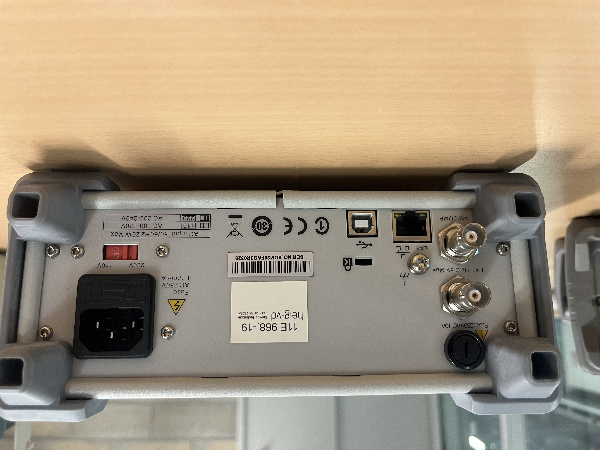

# Projet banc de test pour filtres
## Membres du groupe

- Nicolas Zaco
- Rémy Di Giovanni
- Julien Vullioud
- Martin Luthi

# Objectif du projet

L'objectif de ce projet est de développer un programme en Python permettant de tester un filtre de type quelconque. Le programme interagira avec un générateur de signaux et un oscilloscope afin de générer et d'analyser un diagramme de Bode.

## Description
Ce projet consiste à :

- Interfacer un oscilloscope et un générateur de fonctions avec un PC, afin de réaliser des mesures sur un filtre d'ordre n.

- Utiliser le générateur de fonctions pour produire des signaux sinusoïdaux à fréquence variable, servant d'entrée pour le filtre à tester.

- Mesurer la réponse du filtre avec l'oscilloscope, qui enregistrera l'amplitude et la phase de la sortie du filtre pour différentes fréquences.

- Récupérer les données mesurées par l'oscilloscope via le PC, pour les traiter et caractériser le filtre (gain, réponse en fréquence, etc.).

- Afficher les résultats via une interface graphique, permettant de visualiser les caractéristiques du filtre sous forme de diagramme de Bode.

- Permettre la configuration du test via l'interface graphique : l'utilisateur pourra paramétrer les conditions du test (fréquences, types de signaux, etc.) et lancer le test.

## Diagramme

## Appareils de mesures

### Oscilloscope :

### Générateur de fonctions :

### Multimètre digital :

